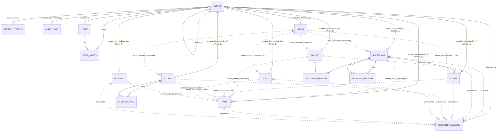
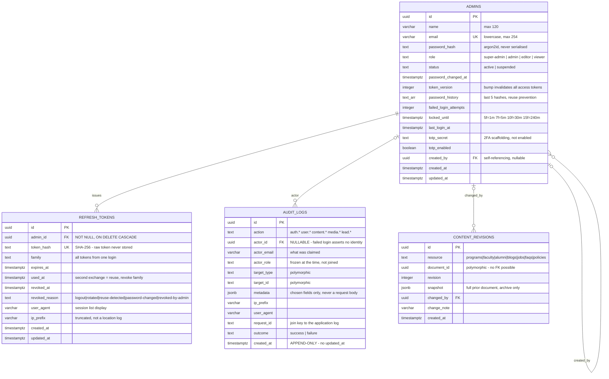
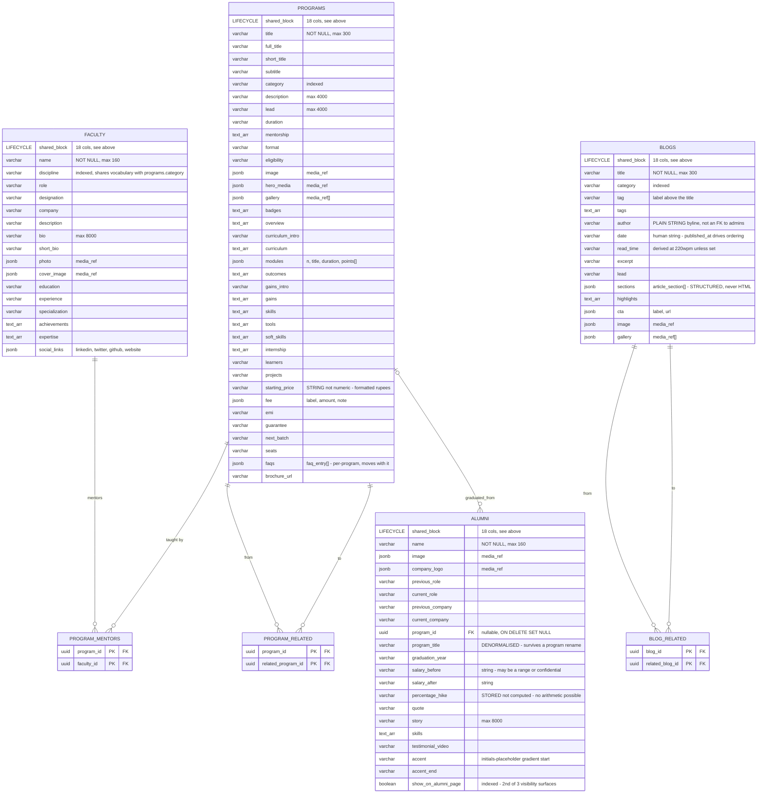
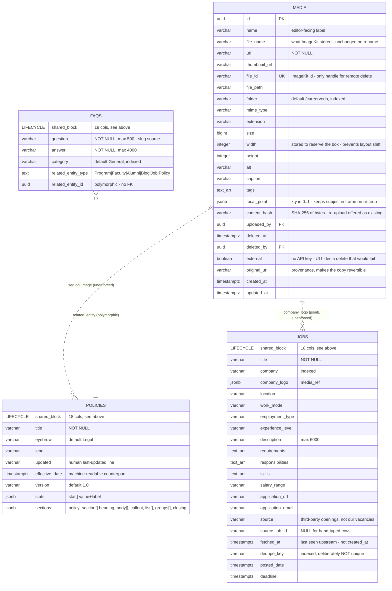
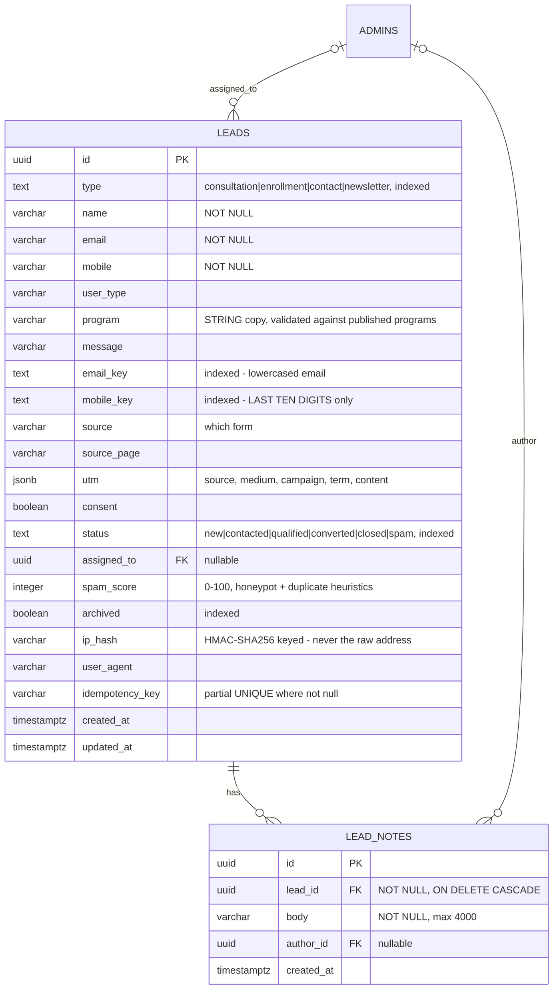

# CareerVeda — Entity Relationship Model

Target: **PostgreSQL 16** (Cloud SQL, asia-south1). Derived field-for-field from
`backend/src/models/*.js`, so this is the current Mongoose schema expressed
relationally — not an aspiration.

**17 tables:** 2 identity · 7 content · 5 supporting · 3 junction.

Legend for every diagram below:

| Notation | Meaning |
|---|---|
| `||--o{` | one → zero-or-many, FK **NOT NULL** |
| `|o--o{` | zero-or-one → zero-or-many, FK **nullable** |
| `..` (dotted) | logical relationship **not enforced** by a foreign key |
| `PK` `FK` `UK` | primary / foreign / unique key |

---

## 0. Overview — all 17 tables



`ADMINS` is the hub — every table except the junctions carries at least one FK
back to it. That is the audit story: nothing changes without a named actor.

---

## Shared lifecycle block

These 18 columns are **identical on all seven content tables** (`programs`,
`faculty`, `alumni`, `blogs`, `jobs`, `faqs`, `policies`). In the source they
come from one Mongoose plugin; in Postgres they are copied into each table.
Shown once here rather than 7× in the diagrams below, where each content entity
carries the marker attribute `LIFECYCLE shared_block`.

| Column | Type | Null | Key | Default | Note |
|---|---|---|---|---|---|
| `id` | uuid | no | PK | `gen_random_uuid()` | |
| `slug` | varchar(140) | no | UK | — | lowercase, derived from title/name/question |
| `status` | text | no | | `'draft'` | CHECK: draft, in-review, scheduled, published, archived |
| `published_at` | timestamptz | yes | | `null` | set on transition, **not** on save |
| `scheduled_at` | timestamptz | yes | | `null` | |
| `featured` | boolean | no | | `false` | |
| `display_order` | integer | no | | `0` | |
| `rejected_reason` | varchar(500) | no | | `''` | cleared on publish |
| `seo` | jsonb | no | | `'{}'` | title, description, keywords[], og_image, canonical_url, no_index |
| `deleted_at` | timestamptz | yes | | `null` | **soft delete** — NULL means live |
| `deleted_by` | uuid | yes | FK→admins | `null` | |
| `created_by` | uuid | yes | FK→admins | `null` | |
| `updated_by` | uuid | yes | FK→admins | `null` | |
| `revision` | integer | no | | `1` | optimistic lock; mismatch ⇒ 409 |
| `created_at` | timestamptz | no | | `now()` | |
| `updated_at` | timestamptz | no | | `now()` | |

Indexes on each of the seven:
`(deleted_at, status, display_order)` · `(deleted_at, status, published_at DESC)` ·
`(status, scheduled_at)` · GIN over a generated `tsvector`.

**Visibility rule** (one definition, used by every public read):

```sql
deleted_at IS NULL
AND ( (status = 'published' AND (published_at IS NULL OR published_at <= now()))
   OR (status = 'scheduled' AND scheduled_at <= now()) )
```

---

## A. Identity, sessions & audit



- `audit_logs` is **append-only**, enforced at the database (`REVOKE UPDATE,
  DELETE` + a trigger), not by convention — an audit trail an attacker can edit
  is worse than none, because it is trusted.
- `content_revisions` is capped at **30 per document** and uniquely keyed
  `(resource, document_id, revision)`.
- MongoDB's TTL index on `refresh_tokens.expires_at` has no Postgres equivalent
  — it becomes a scheduled `DELETE WHERE expires_at < now()`.

---

## B. Content core — programs, faculty, alumni, blogs



**The one real normalisation win.** In Mongo, `programs.mentors[]` and
`faculty.associatedPrograms[]` are two independent arrays describing the same
program↔faculty association from opposite ends — nothing keeps them in sync, so
they can and do disagree. Relationally they collapse into the single
`program_mentors` junction and the disagreement becomes impossible.

**Alumni has three visibility surfaces, two flags** — deliberate:

| Surface | Controlled by |
|---|---|
| Home-page outcome strip | `featured` |
| `/alumni` review grid | `show_on_alumni_page` |
| `/alumni` dome gallery | *nothing* — every published record |

The dome is the complete record of who came through, so it is intentionally not
filterable. Hiding someone from a curated strip must never erase them from it.

---

## C. Standalone content & media



`jobs` carries the schema's cleverest constraint:

```sql
UNIQUE (source, source_job_id) WHERE source_job_id IS NOT NULL
```

A **partial** unique index. This is what makes the hourly third-party ingest
idempotent at the *database* level rather than in sync code — two concurrent
Cloud Run instances re-fetching the same listing cannot create duplicates, the
second insert simply fails the key and is counted. Hand-typed jobs have
`source_job_id = NULL` and are exempt, rather than all colliding on `''`.

`dedupe_key` (normalised title+company+location) is indexed but **not** unique
on purpose: two genuinely different openings can share all three, and a unique
index there would block an admin from creating the second by hand.

---

## D. Lead capture



`email_key` / `mobile_key` are the whole de-duplication story. `mobile_key` is
the **last ten digits**, which is what makes `+91 92178 01191` and `9217801191`
the same person. The two-enrollment cap counts matches with `OR` across both
keys, so a different email with the same phone still counts as one applicant.
Both are candidates for `GENERATED ALWAYS AS` columns in Postgres — Mongo had to
compute them in application code.

`lead_notes` is the **only** embedded array in the whole schema that becomes a
real child table. The signal: in the source it is the one subdocument declared
with `_id: true`, and it carries its own FK to `admins`. Identity plus a
relationship equals an entity; everything else is a value object and stays
`jsonb`.

---

## Relationship matrix

| Parent | Child | Cardinality | FK column | ON DELETE | Optional |
|---|---|---|---|---|---|
| admins | admins | 1 : 0..N | `created_by` | SET NULL | yes |
| admins | refresh_tokens | 1 : 0..N | `admin_id` | CASCADE | **no** |
| admins | audit_logs | 0..1 : 0..N | `actor_id` | SET NULL | yes |
| admins | content_revisions | 0..1 : 0..N | `changed_by` | SET NULL | yes |
| admins | media | 0..1 : 0..N | `uploaded_by`, `deleted_by` | SET NULL | yes |
| admins | leads | 0..1 : 0..N | `assigned_to` | SET NULL | yes |
| admins | lead_notes | 0..1 : 0..N | `author_id` | SET NULL | yes |
| admins | *each of 7 content tables* | 0..1 : 0..N | `created_by`, `updated_by`, `deleted_by` | SET NULL | yes |
| programs | alumni | 0..1 : 0..N | `program_id` | SET NULL | yes |
| leads | lead_notes | 1 : 0..N | `lead_id` | CASCADE | **no** |
| programs ↔ faculty | program_mentors | M : N | both PK | CASCADE | — |
| programs ↔ programs | program_related | M : N self | both PK | CASCADE | — |
| blogs ↔ blogs | blog_related | M : N self | both PK | CASCADE | — |
| media ⇢ 7 content tables | — | 1 : 0..N | inside `jsonb` | **none** | unenforced |
| 7 content tables ⇢ content_revisions | — | 1 : 0..N | `resource` + `document_id` | **none** | polymorphic |
| 6 content tables ⇢ faqs | — | 0..1 : 0..N | `related_entity_type` + `_id` | **none** | polymorphic |
| any table ⇢ audit_logs | — | 0..1 : 0..N | `target_type` + `target_id` | **none** | polymorphic |

Self-referencing pairs should carry `CHECK (a <> b)`. `program_related` is
directional in the source (A relating to B does not imply the reverse), so do
**not** enforce symmetry.

---

## The three polymorphic associations

Postgres cannot express "FK to one of seven tables". All three below keep the
`(type, id)` pair with no FK, which is the right call in each case — but for
different reasons.

| | `faqs.related_entity_*` | `content_revisions.resource + document_id` | `audit_logs.target_*` |
|---|---|---|---|
| Points at | 6 content tables | 7 content tables | anything, incl. deleted rows |
| Alternative worth considering | exclusive arc: 6 nullable FKs + a CHECK that exactly one is set | none — the archive must outlive its subject | none |
| Verdict | **Exclusive arc.** Only 6 targets, referential integrity is worth having, and an orphaned FAQ pointing at a purged program is a real bug. | **Keep as-is.** A revision must survive a permanent purge of the row it describes; an FK would cascade the history away. | **Keep as-is.** The trail must record actions on records that no longer exist. An FK would make the log deletable, defeating its purpose. |

---

## Deliberate denormalisation

Four places where the schema stores a copy on purpose. Each would break if
normalised:

| Redundancy | Why it must stay |
|---|---|
| `media_ref` jsonb copies url / dimensions / alt from `media` | A program card renders 9 images. Nine joins on the hottest public read path buys nothing — these values change only when an admin replaces the asset. `width`/`height` specifically let the frontend reserve the box and avoid layout shift. Cost: the "where is this asset used?" lookup must scan jsonb. |
| `alumni.program_title` alongside `alumni.program_id` | An alumnus graduated from what the program was **called at the time**. Renaming or retiring a program must not rewrite their story. |
| `leads.program` as text, not an FK | Validated against published programs at write time, then frozen. A lead is a historical record of what someone asked about; deleting the program must not corrupt it. |
| `audit_logs.actor_role` | The role **at the time of the action**. Joining to `admins.role` would retroactively rewrite history every time someone is promoted. |

---

## Normal form

**In 3NF:** `admins`, `refresh_tokens`, `lead_notes`, `media`, and all three
junction tables.

**Deliberately not in 3NF**, with the exceptions above as justification:
the seven content tables (jsonb value objects and `media_ref` copies),
`alumni` (`program_title`), `leads` (`program`, plus `email_key`/`mobile_key`
derived from `email`/`mobile`), and `audit_logs` (`actor_email`, `actor_role`).

Every exception is a **point-in-time snapshot** or a **read-path optimisation**.
Neither is a normalisation failure — both are cases where the correct value is
the one that was true when the row was written, not the one that is true now.

---

## Counts

| Group | Tables |
|---|---|
| Identity & sessions | `admins`, `refresh_tokens` |
| Content (shared lifecycle) | `programs`, `faculty`, `alumni`, `blogs`, `jobs`, `faqs`, `policies` |
| Supporting | `leads`, `lead_notes`, `media`, `content_revisions`, `audit_logs` |
| Junction | `program_mentors`, `program_related`, `blog_related` |
| **Total** | **17** |
